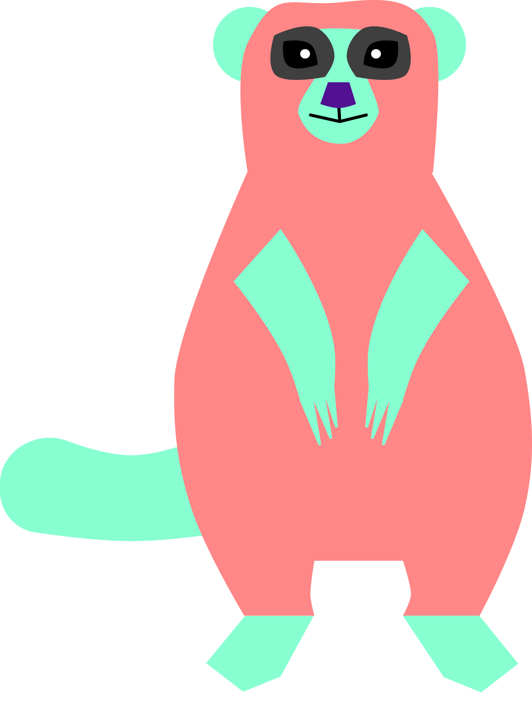

## Mongoose

<div align="center">

</div>

this project is created to increase the privacy & respect the created projects & provide the idle-safety free read & write of the file 

glimpse 👀
```golang

// monitor the upcoming request
cfg := &sdkv2.IConfig{
		TConf: tc,
		QConf: qc,
	}
	acfg := sdkv2.IApp{
		Addr:        "127.0.0.1:5000",
		SendAddr:    "127.0.0.1:5100",
		RecieveAddr: "127.0.0.1:5200",
	}
	app := sdkv2.New(&acfg, cfg, ctx)
	wg.Add(1)
	go func() {
		defer wg.Done()
		app.GoMonitor(ctx, func(track *sdkv2.ITrackFile) {
			if track.IsReady {
				log.Println("doc: ", track.Data.Document())
				log.Println("data: ", track.Data.PeerFileData)

			}
		})
	}()
// end

// send the request
m := &mcrypt.MetaInfo{}
	src := "./tests/samples/fisherchapbook87.pdf"

	bin := "./tests/bin/greet/aaa"

	li := misc.CreateLink(src, bin, m)
	log.Println("created link: ", li)

	m.CustomInfo.SaveFileNameAs = "suceed-result"
	m.ChunkInfo = mcrypt.IChunkInfo{
		DirLocation: bin,
		MarkExt:     "part_",
	}
	ma, err := os.Stat(src)
	if err != nil {
		panic(err)
	}
	x, err := os.ReadFile(src)
	if err != nil {
		panic(err)
	}
	m.FileInfo = mcrypt.IFileInfo{
		Name:      "greet.txt",
		Size:      uint64(ma.Size()),
		Extension: "txt",
		Hash:      misc.CalculateHash(string(x)),
	}
	m.CreatedDate = common.FormatDateForClient(time.Now())
	m.MetaInfo = true
	m.Config.URLs = []string{
		//"127.0.0.1:4200",
		"127.0.0.1:3200",
		//"127.0.0.1:3100",
	}
	m.Config.TCPs = []string{
		"http://127.0.0.1:3000/meta_info",
	}

	w := webaddress.New("http://127.0.0.1:5000")
	base := w.Path("meta_info").Generate()
	w.Request().SetBase(base)
	w.Request().Add("meta_info", "GET", m.Pack()).Go()
    // end

```


# Note
this was my project of july, tho it is kind of untested
and I was unable to give time to this project was handling a lot that time
and I noticed just today that I have repo if I cannot able to complete this I hope someone can complete or use 


# References that are used and to be read
ACE-> [cutting-file-into-pieces](//ref/cutting-file-into-pieces.pdf) this is the name i gave it
this formula typically helped in file chunking

## PLAN
```
# Motivation
this project is created to increase the privacy & respect the created projects & provide the idle-safety free read & write of the file 

---

# Languages
# what is the use of golang?
 go-lang is use for network transmission & has some in-built interfaces

# why rust?
 i thought rust might be best use-case for the offline **os** controlling typically stuffs related to sending **createing-file-chunk**, **sending-meta-info-of-current-file-chunk** and so on and forth required by golang 
and yes, you can argue that i dont want to touch **C | C++** at this point of time
---
# Mental Model

tho i have hand drawn server model 😎 i'll try to explain it here too

R1 -> rust-file serves to the hosting machine typically our backend servers
R2 -> rust-file serves to the user machine
 
golang is the responsible for the networking

rust is responbile for the file chunk and getting required info of the user machine

**the model is divided into 2 main-section**
1. server-upload
2. client-upload

---

## Server-Upload-Model
 **the model is divided into 2 main-section**
 1. server-write
 2. server-pull

**server-write**
we write the compressed file of snapshot in the bin folder on the provided disk itself
and from that bin folder we transfer the **file-chunks** into N_number of servers
writing is done using **rust**
transfering is done using **golang go-quic**
**server-pull**
we first create the bin folder on the disk to pull the **file-chunks** from N_number of servers
the **file-chunks** are joined in the config  disk location & bin folder is safely deleted
pulling is done using **golang go-quic**
writing is done using **rust**

----

# Client-Upload-Model
**the model is diided into 2 main-section**
1. client-read
2. user-pull

**client-read**
we write the compressed file of snapshot in the bin fodler on the provided disk itself
and from the bin folder we collect the meta-info and upload the meta-info required by the **golang** to download the file on the user machine
here in this case rust -> tells -> golang -> to push the request
writing is done using **rust**
transfering is done using **golang go-quic**
**NOTE** the file can be donloaded as long as the user has the file on the machine

**user-pull**
we first create the bin folder on the disk to pull the **file-chunks** from the uploaded author machine
the **file-chunks** are joined in the config disk location & bin folder is safely deleted
pulling is done using **golang go-quic**
writing is done using **rust**

---
```

## Todo
- file compression methods during chunking
- remote transfer packets so that we can have something alike ultra-viewer